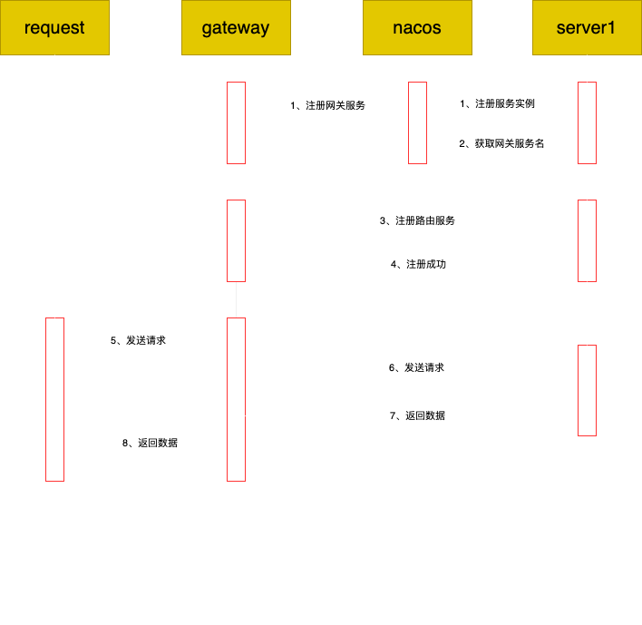

# Gateway路由策略注册服务

## 1、背景
在传统的软件测试过程中，测试人员在专门的测试环境测试功能，当发现bug时，在issue中录入信息和步骤，反馈给到开发人员。
但是由于各种原因，开发人员按照测试人员提出的issue也不能复现出问题，只能归类为玄学。

亦或者，分支很多，但是由于一些原因不能将这些分支合并，但是要提供这些分支的测试环境，还没有这么多测试服务器。

## 2、问题
网关可以解决这个问题，可以通过网关提供不同的路由策略将请求分发到不同的服务器。
如测试人员通过不同的header将产生问题的请求发到开发人员服务器，可以让开发人员断点排查问题。
根据不同的分支配置不同的规则，要测什么分支就切换。

又有同学要问题了，利用nginx和gateway都可以根据不同规则实现请求分发，你这个有什么特殊的。
的确它们都可以实现，但是它们都不可避免的需要修改配置文件，并重启服务才能实现，会造成频繁重启服务导致其他服务不可用。

## 3、解决方案
能不能类似nacos的注册功能一样，将服务的请求分发规则注册到网关上，那样网关服务就不需要关闭，并可以做到即插即用。

