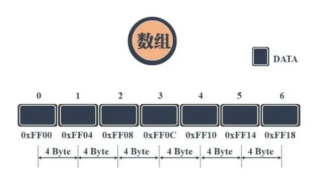
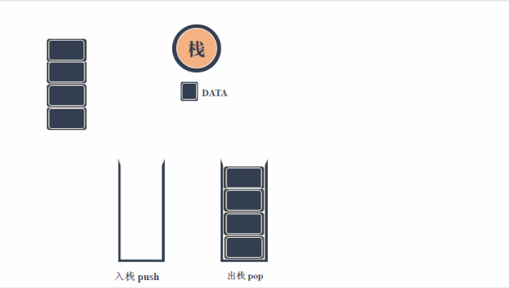
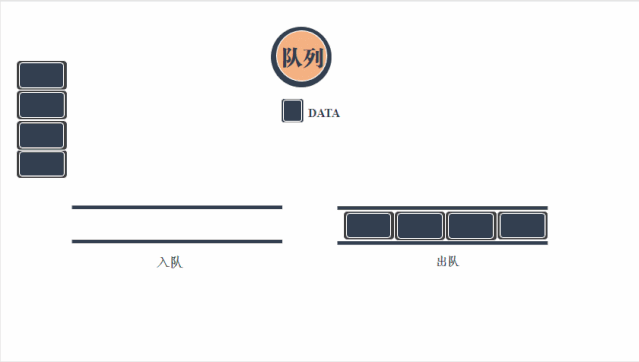
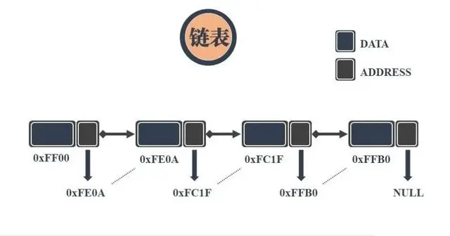
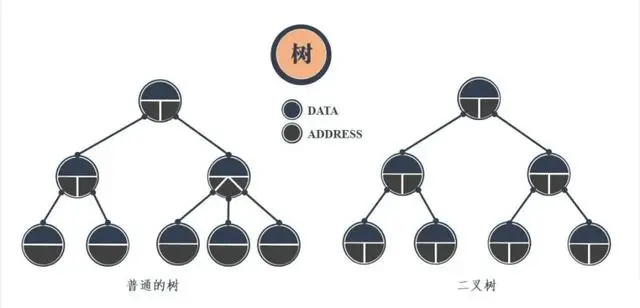
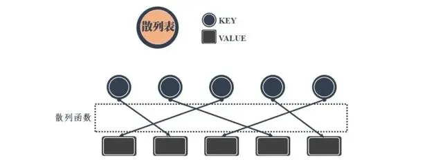
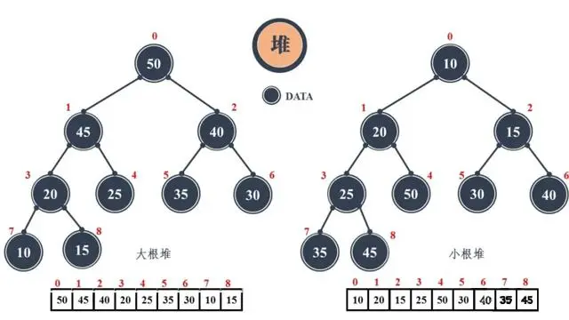
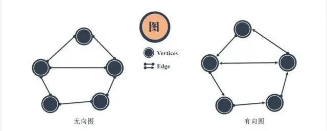

# 八大数据结构
数据在电脑中的储存不是简单的按照先来后到依次排列，而是有多种不同的非直线的排序方式，目的是为了节省空间、方便存储和调取，由此便有“数据结构”一称。

数据结构是计算机存储和组织数据的方式。八大基本数据结构形式有：数组（Array）、栈（Stack）、队列（Queue）、链表（Linked List）、树（Tree）、图（Graph）、堆（Heap）、散列表（Hash）。

## 1、数组
数组是可以在内存中连续存储多个元素的结构，在内存中的分配也是连续的，数组中的元素通过数组下标进行访问，数组下标从0开始。

## 2、栈
栈是一种特殊的线性表，仅能在线性表的一端操作，栈顶允许操作，栈底不允许操作。 栈的特点是：先进后出，或者说是后进先出，从栈顶放入元素的操作叫入栈，取出元素叫出栈。栈的结构就像一个集装箱，越先放进去的东西越晚才能拿出来，所以，栈常应用于实现递归功能方面的场景，例如[斐波那契数列](数学公式.md/#斐波那契数列)。

## 3、队列
队列与栈一样，也是一种线性表，不同的是，队列可以在一端添加元素，在另一端取出元素，也就是：先进先出。从一端放入元素的操作称为入队，取出元素为出队。

# 4、链表
链表是物理存储单元上非连续的、非顺序的存储结构，数据元素的逻辑顺序是通过链表的指针地址实现，每个元素包含两个结点，一个是存储元素的数据域 (内存空间)，另一个是指向下一个结点地址的指针域。根据指针的指向，链表能形成不同的结构，例如单链表，双向链表，循环链表等。

# 5、树
树是一种数据结构，它是由n（n>=1）个有限节点组成一个具有层次关系的集合。把它叫做 “树” 是因为它看起来像一棵倒挂的树，也就是说它是根朝上，而叶朝下的。它具有以下的特点：
* 每个节点有零个或多个子节点；
* 没有父节点的节点称为根节点；
* 每一个非根节点有且只有一个父节点；

除了根节点外，每个子节点可以分为多个不相交的子树。

# 6、散列表
散列表，也叫哈希表，是根据关键码和值 (key和value) 直接进行访问的数据结构，通过key和value来映射到集合中的一个位置，这样就可以很快找到集合中的对应元素。

# 7、堆
堆是一种比较特殊的数据结构，可以被看做一棵树的数组对象，具有以下的性质：
* 堆中某个节点的值总是不大于或不小于其父节点的值；
* 堆总是一棵完全二叉树；
  

# 8、图
图是由结点的有穷集合V和边的集合E组成。
其中，为了与树形结构加以区别，在图结构中常常将结点称为顶点，边是顶点的有序偶对，若两个顶点之间存在一条边，就表示这两个顶点具有相邻关系。

